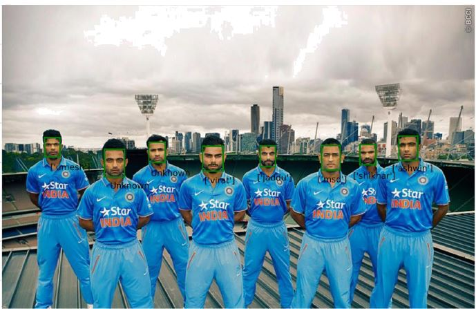

# Face-Verification

A sample output of recognising Indian cricket players

For Face Verification to be done -
We first use MTCNN to detect faces from given image and then pass it to FaceNet algorithm which converts these faces to 128 dimension vector which then can be used with SVM to make a recognition
